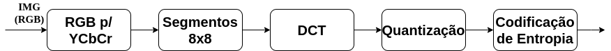

# Image Encoder 
 
## Goal:
Implementation of a simple image encoder, following the steps described below.

## Development environment
- [Link to Colab](https://colab.research.google.com/drive/17r8eP3Zv74uoawHFzeVABmrUVnn8AZnu?usp=sharing)

### Libraries:
- [NumPy](https://numpy.org/doc/)
- [Matplotlib](https://matplotlib.org/stable/users/index.html)
- [SciPy](https://docs.scipy.org/doc/)
- [OpenCV ](https://docs.opencv.org/)

## Implementation teps:

### 1ª - Conversion of Color Maps

### 2ª - 8x8 segmentation
### 3ª - DCT
### 4ª - Quantization
### 5ª - Entropy Encoding

## References:
- [Tutorial OPENCV Python - Acervo Lima](https://acervolima.com/tutorial-opencv-python/)
- [How Image Compression Works](https://youtu.be/Ba89cI9eIg8)
- [How Video Compression Works](https://youtu.be/QoZ8pccsYo4)